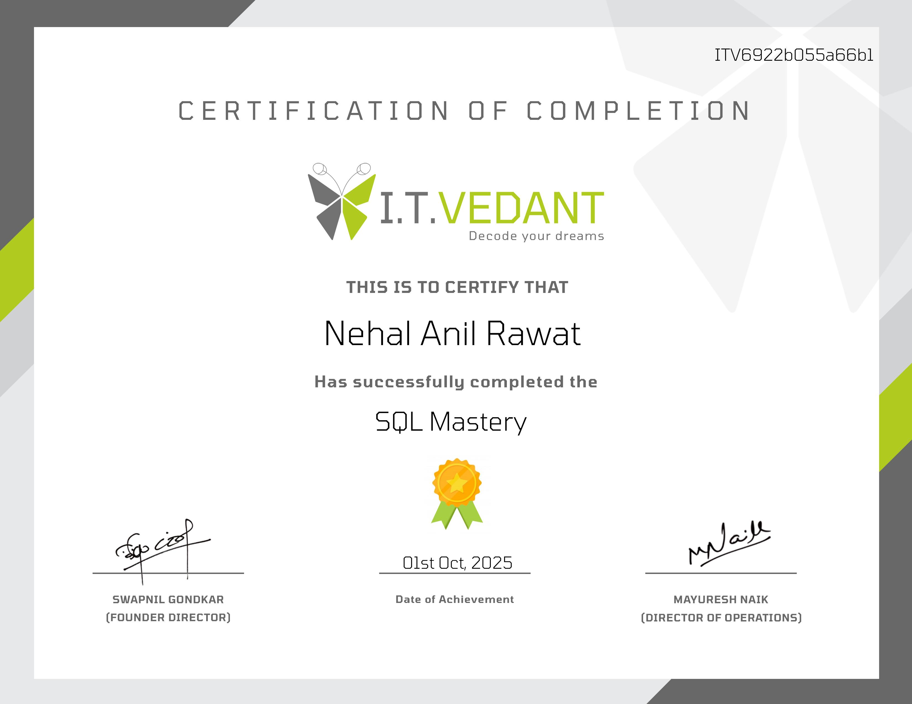

# 👋 Hi, I'm Nehal!

Welcome to my GitHub profile!  
I'm exploring and learning data analytics — focusing on tools like Excel, SQL, Power BI, Tableau, and Python.  
This profile README will also display the certifications I've completed.

---

## 📜 Certifications

### 🟢 Advanced Excel  
**Issued by:** I.T. Vedant  
**Date:** 12th September 2025  

---

### 🔵 SQL Mastery  
**Issued by:** I.T. Vedant  

---

### 🟡 Power BI Essentials  
**Issued by:** I.T. Vedant  
**Date:** 29th October 2025  

---

### 🔶 Tableau Essentials  
**Issued by:** I.T. Vedant  
**Date:** 17th November 2025  

--!
